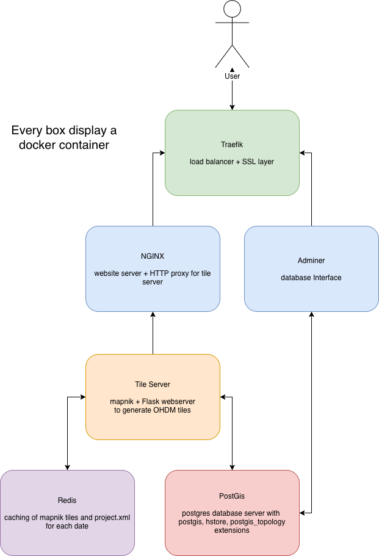

# OHDM-Docker

[](https://docker-ohdm.readthedocs.io/en/latest/?badge=latest)
     
It's a `docker-compose` repo for the new version of http://www.ohdm.net/, but it's just the beginning, so
do what you want and get back later :)



```
computermuseum
│   .env                               # enviroment var file
│   .env-example                       # example enviroment var file
│   .gitignore
│   .readthedocs.yml                   # config file for https://readthedocs.org/
│   docker-compose.yml                 # docker-compose file
│   LICENSE 
│   project.mml                        # mapnik style, edit only for develop / testing purpose
│   README.md  
│    
└───docs                               # docs based on https://readthedocs.org/
│
└───import                             # dockerfile & startup script to import database
│
└───nginx                              # nginx conf files
│
└───proxy                              # traefik conf files
│
└───tile_server                        # wordpress files
│   │   dockerfile                     # tile_server dockerfile
│   │   requirements.txt               # python dependencies for the tile server
|   |   date_template_importer.py      # script for inserting date template into Mapnik style conf file
│   └───app
│       │   __init__.py
│       │   app.py                     # tile server code (flask & mapnik)
│       │   wsgi.py                    # start script for the production server
│
└───website                            # html content of demo OHDM website
```

## minimum Server Requirements for developing

- 3 GB of RAM
- 20 GB of free disk space

## Quickstart

**1. create** `.env`

Copy `.env-example` to `.env` and change it to you needs

If you need more explanation about the `.env` file, look in the docs -> https://readthedocs.org/projects/docker-ohdm/

```bash
$ cp .env-example .env
$ vim .env
```

**2. Import**

TODO 

**3. Create docker network** `web`

```bash
$ docker network create web
```

**4. Build Docker Image**

```bash
$ docker-compose build
```

**5. Execute Docker**

```bash
$ docker-compose up -d webserver
```
