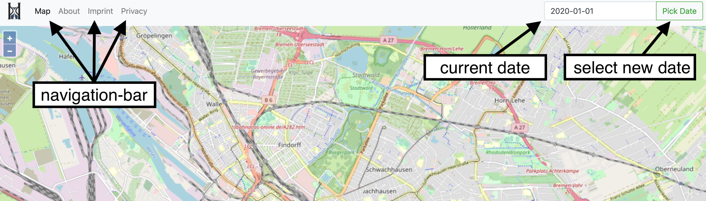

# OHDM MapnikTileServer

The [OpenHistoricalDataMap](https://github.com/OpenHistoricalDataMap)
[MapnikTileServer](https://github.com/OpenHistoricalDataMap/MapnikTileServer) is an
[OpenStreetMap](https://www.openstreetmap.org/) time sensitive fullstack tile server. This means you can go back in time
on a OpenStreetMap Map and see how your city changed since you was a child or you can go much more back in time, it's
your choice :)

The project is build with [Django Cookiecutter](https://github.com/pydanny/cookiecutter-django/) and it comes with
docker support, it is design to work out of the box with Docker.

The current version of this project based on a fork of [openstreetmap-carto](https://github.com/OpenHistoricalDataMap/openstreetmap-carto/).

## Features

- documentation: https://github.com/OpenHistoricalDataMap/MapnikTileServer/wiki
- work out of the box, no special configuration is need
- work Linux, MacOS, BSD & also should work Windows Pro, just need Docker & Docker-Compose to work
- OSM based tile server with time sensitive tiles
- a development & production configuration
- task-queue for rendering tile with [celery](http://www.celeryproject.org/)
- caching tiles in redis
- SSL with Let's Encrypt included
- generate development database from osm / ohdm
- include [sentry.io](https://sentry.io/) in production for error tracking

## Dependencies

### Tile Server

- a custom fork of [openstreetmap-carto](https://github.com/OpenHistoricalDataMap/openstreetmap-carto/) for tile styles and SQL
- [https://mapnik.org/](https://mapnik.org/)
- [python-mapnik](https://github.com/mapnik/python-mapnik)

### Front-End

- [Bootstrap 4](https://getbootstrap.com/) Theme
- [OpenLayers](https://openlayers.org/) for map view

Frontend example repo: https://github.com/OpenHistoricalDataMap/ohdm-angular-frontend

## minimum server requirements for developing

- 8 GB of RAM
- 100 GB of free disk space (better using a SSD drive instead of HDD)

If you can, use beefy hardware!
