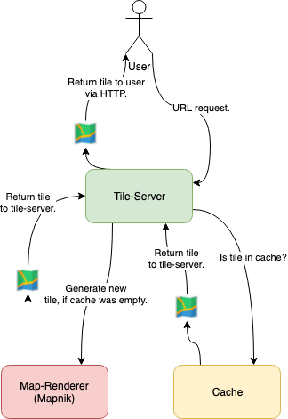
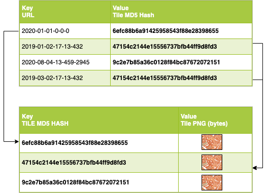

Caching
=======

Basic
-----

There are 3 tings, that will be cached.

1. Mapnik Style XML for each date
2. tile cache location
3. tile

The cache will be filled on each ``HTTP`` request, where there is no cached file
or when using the prerendering command.::

    $ docker-compose -f local.yml run --rm django python manage.py prerender [ZOOM_LEVEL]

Below is a diagram, how the cache is used in a view.

   Tile Server overview

Caching Objects
---------------

1. Mapnik Style XML for each date
.................................

Cache will be created, when a tile process is running. For each date, the system
need a different mapnik style XML.

2. tile cache location
.................................

Cache location of a tile. To save space on the cache server, every tile will
be hashed with ``MD5`` and saved under the ``MD5`` value. When multiple tiles have
the same ``MD5`` hash, then only one tile will be saved. The cache location key
is ``year-month-day-zoom-X-Y``.

   tiles of a map

3. tile
.................................

Finally, the tile PNG. The cache key is the hash value of the tile.

Config
---------------

In the config file, you can set, how low the cache should be saved.::

    # caching
    # ------------------------------------------------------------------------------
    # to which zoom level tiles should cached for ever
    ZOOM_LEVEL=13
    # 2592000 == 1 month
    TILE_CACHE_TIME=2592000

**ZOOM_LEVEL** to which zoom level the cache should be stored for ever.

**TILE_CACHE_TIME** how long a tile should be cached in seconds.

Caching Objects
---------------

To clear up all cached files use::

    $ docker-compose -f local.yml run --rm django python manage.py clear_cache

But be careful, this command can't be undone!

Compression
-----------

To save space on the cache system, any cache object will be compressed with ``lzma``.
For changing the compression mode, modify ``config/settings/production.py`` under
``CACHES``. On https://docs.python.org/3/library/lzma.html#module-lzma is a list,
with all available compression modes.
