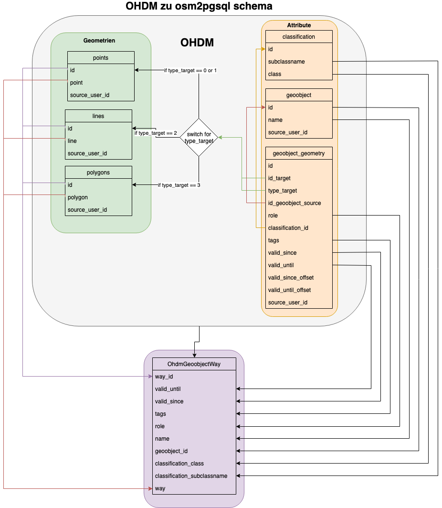
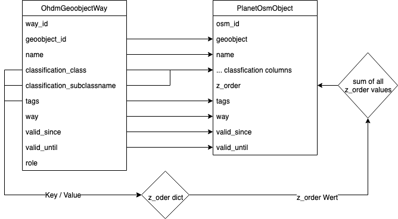
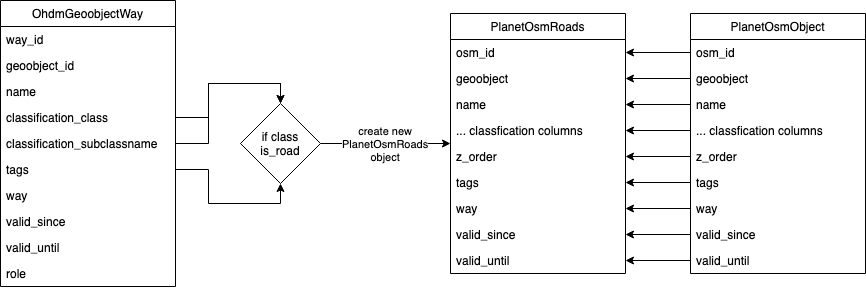

ohdm2mapnik
===========

Intro
-----

`ohdm2mapnik` convert a `OHDM database schema
<https://github.com/OpenHistoricalDataMap/OSMImportUpdate/wiki>`_ to a mapnik
readable `Osm2pgsql <https://wiki.openstreetmap.org/wiki/Osm2pgsql/schema>`_
schema.

Database setup
--------------

.. note::
    This project does not contain an option to create a time sensitive OSM database.
    For this purpose use https://github.com/OpenHistoricalDataMap/OSMImportUpdate !

For this command a `OHDM` database connection is need to set up in
``.envs/.local/.postgres`` for the developing instance and for production is it
``.envs/.production/.postgres``.

An example will look like::

    # OHDM PostgreSQL
    # ------------------------------------------------------------------------------
    OHDM_SCHEMA=ohdm

Theory
------

For converting the database from OHDM schema to Osm2pgsql (mapnik readable)
schema, the command will create an SQL statement, which will merge multiple
OHDM tables into one output.

The tables are ``classification``, ``geoobject``, ``geoobject_geometry`` and
one of ``points``, ``lines`` or ``polygon``, depending on the ``type_target``
in the ``geoobject_geometry`` table. So if the ``type_target`` is ``0`` or ``1```
it will create points, for 2 lines and 3 it will create polygons.

In :numref:`ohdm2mapnik_OHDM2SingleTable` is an explanation, which data are
use for merging the tables.

.. _ohdm2mapnik_OHDM2SingleTable:


    Merge ohdm tables into one output

As next step, the ``z_order`` will be computed through the given data.
The ``z_order`` is use in mapnik to order the objects for the renderer, so that
an object with a higher ``z_order`` will be overdrawn an object with a lower ``z_order``.
To compute the ``z_order``, every classification entry & every tag in ``tags`` will
be gone a dict, where is defined how to rank an object.
In :numref:`ohdm2mapnik_SingleTable2Mapnik` is an diagram how to calc the ``z_order``.

.. _ohdm2mapnik_SingleTable2Mapnik:


    Calc z_order

In the same time, when compute the ``z_order``, the system check if the dict which
contains the ``z_order`` values, has a value for ``is_road``. If this is ``true``,
a new ``PlanetOsmRoads`` object will be created from the data in the previous
generated osm object.
In :numref:`ohdm2mapnik_planet_osm_roads` is a diagram how a ``PlanetOsmRoads``
object will be created.

.. _ohdm2mapnik_planet_osm_roads:


    planet_osm_roads

The code of the converter is mostly in `ohdm2mapnik.py
<https://github.com/OpenHistoricalDataMap/MapnikTileServer/blob/master/ohdm_django_mapnik/ohdm/ohdm2mapnik.py>`_.

Usage
-----

For production instance use ::

    $ docker-compose -f production.yml run --rm django python manage.py ohdm2mapnik

For local instance use ::

    $ docker-compose -f local.yml run --rm django python manage.py ohdm2mapnik

Optional parameters
...................

--clear_mapnik_db
    Clear mapnik (osm2pgsql) data & tile cache

--cache [CACHE]
    Amount of object which will be handle at once!

--convert_points
    Points convert will be enabled, if set, only enabled geometries will be converted. By default, all geometries will be
    converted.

--convert_lines
    Lines convert will be enabled, if set, only enabled geometries will be converted. By default, all geometries will be
    converted.

--convert_polygons
    Polygons convert will be enabled, if set, only enabled geometries will be converted. By default, all geometries will be
    converted.

--sql_threads [SQL_THREADS]
    How many threats should be use, to insert entries into the database.

--not_fill_ohdm_tables
    Do not fill the ohdm cache table. Do this only if the ohdm cache tables already filled!

.. hint::
    To reset just the mapnik tables (``planet_osm_*``) use
    ``docker-compose -f local.yml run --rm django python manage.py migrate ohdm zero``.
    For faster database testing!
