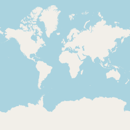
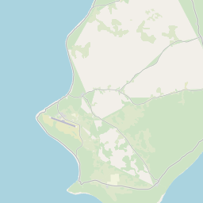

Getting Up and Running Locally With Docker
==========================================

The steps below will get you up and running with a local development environment.
All of these commands assume you are in the root of your generated project.

Prerequisites
-------------

* Docker; if you don't have it yet, follow the `installation instructions`_;
* Docker Compose; refer to the official documentation for the `installation guide`_.

.. _`installation instructions`: https://docs.docker.com/install/#supported-platforms
.. _`installation guide`: https://docs.docker.com/compose/install/

Install
-------

Dowload the MapnikTileServer & openstreetmap-carto.::

    $ git clone git@github.com:OpenHistoricalDataMap/MapnikTileServer.git
    $ git clone git@github.com:linuxluigi/openstreetmap-carto.git

Go to the MapnikTileServer and build up all images. This could take some time ::

    $ cd MapnikTileServer
    $ docker-compose -f local.yml build

Download the shapefiles::

    $ docker-compose -f local.yml run --rm django /get-shapefiles.sh

Create the base mapnik style xml::

    $ docker-compose -f local.yml run --rm django python manage.py create_style_xml

Start the postgres server and create the mapnik tables.::

    $ docker-compose -f local.yml up -d postgres
    $ docker-compose -f local.yml run --rm django python manage.py migrate

Create a demo OHDM database::

    $ docker-compose -f local.yml up test-database

Convert the OHDM data into mapnik tables (osm2pgsql)::

    $ docker-compose -f local.yml run --rm django python manage.py ohdm2mapnik

Start celery worker & beat::

    $ docker-compose -f local.yml up -d celerybeat celeryworker

Start the django webserver::

    $ docker-compose -f local.yml up django

Now test on http://localhost:8000/2020/01/01/0/0/0/tile.png if you see the world mapnik
like below.

   world map

To check if the demo data was setup right, go to
http://localhost:8000/YEAR/MONTH/DAY/11/57/1134/tile.png. But change **YEAR**,
**MONTH** & **DAY** to your current day. For example the like for the 2020-05-27
will be http://localhost:8000/2020/05/27/11/57/1134/tile.png
The result should look like the tile below.

   niue
