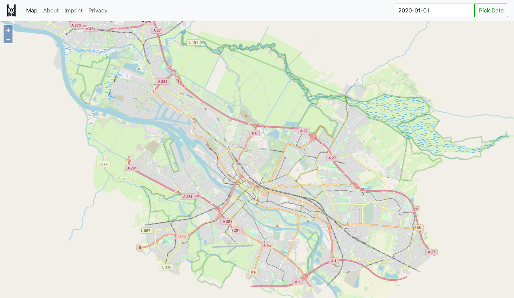
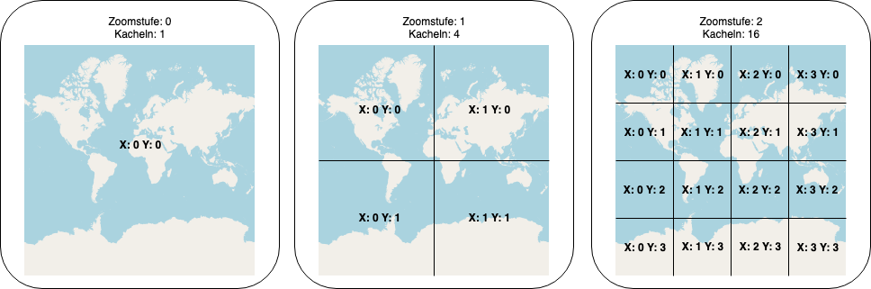
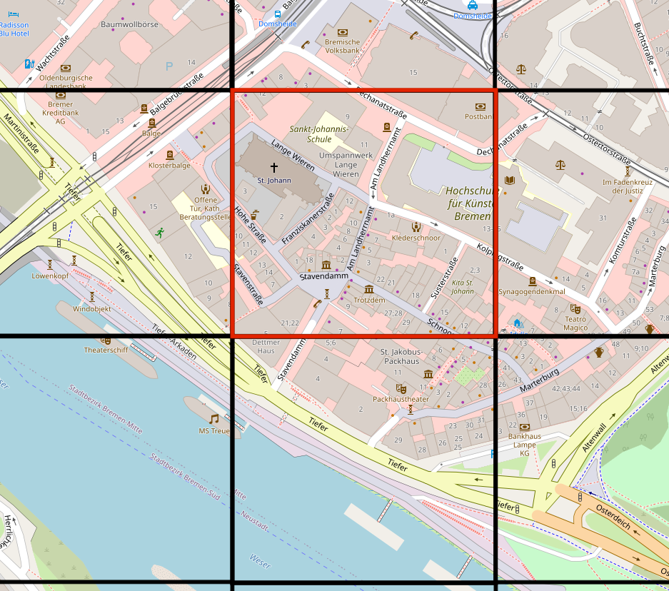
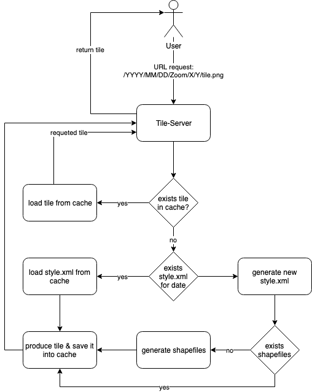
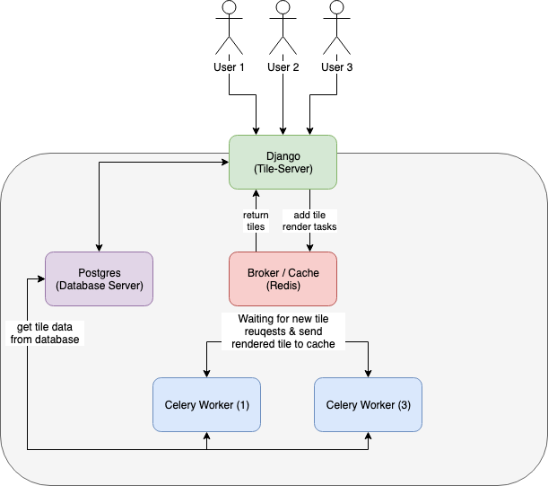

Intro
=====

The MapntikTileServer is a time sensitive mapnik based tile server for
`OpenStreetMap <https://www.openstreetmap.org/>`_ and `Open Historical Data Map <http://www.ohdm.net/>`_.
Written in python with the web framework `Django <https://www.djangoproject.com/>`_ and
the official `OpenStreetMap <https://www.openstreetmap.org/>`_  style sheets.

   MapntikTileServer Frontend

What is a Tile?
---------------

A tile is a part of a map. On each zoom level, the map is split into zoom^4 map parts (tiles).

   Tile

What is a Tile server?
----------------------

A Tile Server is a web service which handle user request over the ``HTTP`` / ``HTTPS``
protocol. A user request is defined over the request URL, as response get the user
a single tile of a map.

.. figure:: _static/tile-server/tile-server-task.png
   :align: center
   :alt: Tile Server overview

   Tile Server overview

   tiles of a map

There are some JavaScript libraries, which can handle tile server request and
merge each tile to a map. The two most common libraries are `Leaflet <https://leafletjs.com/>`_
and `OpenLayers <https://openlayers.org/>`_.

MapntikTileServer vs other Tile-Servers
---------------------------------------

The main difference is, that this tile server can handle time request. So you
can request a map of a specific date. To handle date specific request,
the project `openstreetmap-carto <https://github.com/gravitystorm/openstreetmap-carto/>`_
was use as base. `Openstreetmap-carto <https://github.com/gravitystorm/openstreetmap-carto/>`_
is the github repository for the style sheets, which are used on https://openstreetmap.org/.
To add time sensitive request, the project was `forked <https://github.com/linuxluigi/openstreetmap-carto/>`_
and the ``project.mml`` file was modified to make ``SQL`` request for a specific day.

On the diagram below, is the workflow of the MapntikTileServer.

   MapntikTileServer workflow

Cookiecutter Django
-------------------

The project was created with
`Cookiecutter Django <https://github.com/pydanny/cookiecutter-django>`_ and
build up with docker. So if you unsure how to use this MapntikTileServer,
read the `Cookiecutter Django Docs <https://cookiecutter-django.readthedocs.io/en/latest/>`_
for help.

For faster developing and better testing, this project use Docker and Docker-Compose
to build and run the MapntikTileServer.

Celery Task Queue
-----------------

For the production setup, the tile are produce in a `Celery-Task-Queue <https://celeryproject.org/>`_.
Celery is a python task queue, which run in extra threads / container for more
performance. For every URL of a tile, which is not already in the cache, there
will be triggered a new task on the queue.

   Celery-worker get work from broker.

Every celery container have multiple threads, where it can process tile request. To scale
up the production you can use with docker::

   $ docker-compose -f production.yml scale celeryworker=2

Celery auto scale the threads, depending on your system load,
as a recommendation is to scale celery to 2 containers.

More on: https://cookiecutter-django.readthedocs.io/en/latest/deployment-with-docker.html#building-running-production-stack

   Celery-Task-Queue

