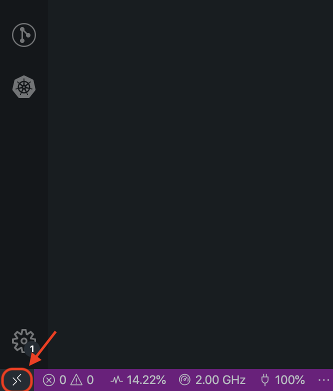
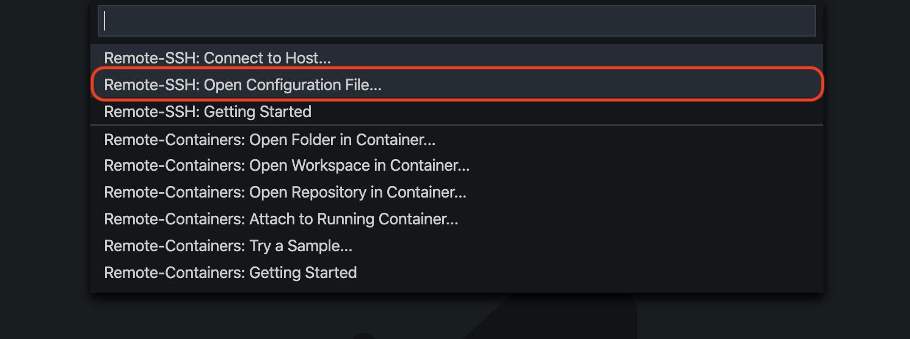

Setup Development Instance
==========================

About
-----

The project is `Docker <https://www.docker.com/>`_ based. That means, the
development requirements are just `Docker <https://www.docker.com/>`_ and 
`Docker Compose <https://docs.docker.com/compose/>`_. Every other dependency
will be automatically installed in a container. So the host system stays clean
and every dveloper has the same dependencies!

Since the project need some beefy hardware and a strong network connection, it's
recommended to use a :ref:`ide_remote_server`. But it's also possible to setup
everything on the :ref:`ide_localhost`.

To start developing fast, it's recommended to use `VS Code
<https://code.visualstudio.com/>`_ as IDE. Facebook & Microsoft created an
extention to `Remote Development 
<https://marketplace.visualstudio.com/items?itemName=ms-vscode-remote.vscode-remote-extensionpack>`_,
with this extension is it possible to use a remote server like it is in front
of you.

.. _ide_localhost:

Localhost
---------

.. _ide_remote_server:

Remote Server 
-------------

.. note::
    This tutorial is testet on ``Ubuntu 18.04``, it should also work under other
    Debian server.

.. _server_hoster:

Tested server hoster
^^^^^^^^^^^^^^^^^^^^

+-------------------------------------------------------------------+--------------------------+
| Hoster                                                            | Status                   |
+===================================================================+==========================+
| `Strato VServer <https://www.strato.de/server/linux-vserver/>`_   | Unstable: threats limits |
+-------------------------------------------------------------------+--------------------------+
| `Digital Ocean <https://www.digitalocean.com/>`_                  | Works fine               |
+-------------------------------------------------------------------+--------------------------+
| `Hetzner Cloud <https://www.hetzner.com/cloud>`_                  | Works fine               |
+-------------------------------------------------------------------+--------------------------+

Setup server
^^^^^^^^^^^^

At first connect to your remote server via ``SSH`` like::

    $ ssh root@your-server-ip

Update the server::

    $ sudo apt-get update
    $ sudo apt-get dist-upgrade

Create a new user (in this case ``foo``) and add him to the sudo group::

    $ adduser foo
    $ adduser foo sudo

Log into your new user::

    $ su foo
    $ cd

Add to ``~/.ssh/authorized_keys`` your ssh public key. If you don't have a SSH
key, go to `Ubuntu Wiki <https://help.ubuntu.com/community/SSH/OpenSSH/Keys>`_
to see how to create one.::

    $ mkdir ~/.ssh
    $ nano ~/.ssh/authorized_keys

Secure ``SSH`` to only allow to login as non root user and via ssh key.::

    $ sudo nano /etc/ssh/sshd_config

Change ``PermitRootLogin yes`` to ``PermitRootLogin no`` and 
``PasswordAuthentication yes`` to ``PasswordAuthentication no``. Than press ``F2``
and ``y`` and ``enter`` to save the file.

After changing the file, reload the ``SSH`` service::

    $ sudo /etc/init.d/ssh reload

Setup firewall with ``ufw``, for a detail instruction go to
`Ubuntu Wiki <https://help.ubuntu.com/lts/serverguide/firewall.html>`_

    $ sudo apt-get install ufw
    $ sudo ufw allow 22
    $ sudo ufw enable
    $ sudo ufw status

Next install Docker, this is a quick instruction, for a more complex instruction
go to `docs.docker.com/install <https://docs.docker.com/install/>`_!::

    $ sudo apt-get install \
        apt-transport-https \
        ca-certificates \
        curl \
        gnupg-agent \
        software-properties-common \
        python-pip \
        python-setuptools \
        python3-pip \
        python3-setuptools
    $ curl -fsSL https://download.docker.com/linux/ubuntu/gpg | sudo apt-key add -
    $ sudo apt-key fingerprint 0EBFCD88
    $ sudo add-apt-repository \
    "deb [arch=amd64] https://download.docker.com/linux/ubuntu \
    $(lsb_release -cs) \
    stable"
    $ sudo apt-get update
    $ sudo apt-get install docker-ce docker-ce-cli containerd.io

Test if docker works::

    $ sudo docker run hello-world

Install `docker compose <https://docs.docker.com/compose/install/>`_::

    $ sudo pip3 install docker-compose

Add user ``foo`` to docker group, to run docker commands without ``sudo``::

    $ sudo usermod -aG docker foo

Logout & login again to enable the changes. Than test if the user can use
docker commands::

    $ docker run hello-world

Enable the docker API for localhost. For that edit the file
``/lib/systemd/system/docker.service`` and change the line begining with
``ExecStart=`` to ``ExecStart=/usr/bin/dockerd -H fd:// -H tcp://localhost:4243``.::

    $ sudo nano /lib/systemd/system/docker.service
        #  change ExecStart= -> ExecStart=/usr/bin/dockerd -H fd:// -H tcp://localhost:4243
    $ sudo systemctl daemon-reload
    $ sudo systemctl restart docker

To test if the api access works, create a http request::

    $ curl -X GET http://localhost:4243/images/json
    [{"Containers":-1,"Created":1546306167,"Id":"sha256:fce289e99eb9bca977dae136fbe2a82b6b7d4c372474c9235adc1741675f587e","Labels":null,"ParentId":"","RepoDigests":["hello-world@sha256:9572f7cdcee8591948c2963463447a53466950b3fc15a247fcad1917ca215a2f"],"RepoTags":["hello-world:latest"],"SharedSize":-1,"Size":1840,"VirtualSize":1840}] 

Next setup ``GIT``. To install just use ``apt-get``::

    $ sudo apt-get install git

To configure git use::

    $ git config --global user.name "user_name"
    $ git config --global user.email "your_email@example.com"

Create a new github SSH key, for deployment new commits ::

    $ ssh-keygen -t rsa -b 4096 -C "your_email@example.com"

Add your new generated key to github.com:: 

    $ cat ~/.ssh/id_rsa.pub

Add the content of ``~/.ssh/id_rsa.pub`` to `github.com/settings/keys
<https://github.com/settings/keys`_.

At last, download the git repo via ``SSH``. You can use the offical repo
``git@github.com:OpenHistoricalDataMap/MapnikTileServer.git`` or use you own
fork.::

    $ git clone git@github.com:OpenHistoricalDataMap/MapnikTileServer.git ~/MapnikTileServer

Now the server is ready to work :)

Setup VS Code
^^^^^^^^^^^^^

At first download & install `VS Code <https://code.visualstudio.com/>`_ for your
desktop OS.

To work on a remote server, install the offical `Remote Development
<https://marketplace.visualstudio.com/items?itemName=ms-vscode-remote.vscode-remote-extensionpack&ssr=false#review-details>`_.
Next configure the access to the remote host, for that open in VS Code. For that
click in the left bottom of VS Code on the remote extension.

If you need more information, go to the `offical docs
<https://code.visualstudio.com/docs/remote/ssh>`_.

   VS Code - use remote extension

Than select ``Remote-SSH: Open Configuration File...``

   VS Code - select ``Open Configuration File``

Select your configuration file and than setup your host::

    Host HostShortName
        HostName HostIpAddress
        User foo
        LocalForward 127.0.0.1:4243 127.0.0.1:4243
        LocalForward 127.0.0.1:5500 127.0.0.1:5500
        LocalForward 127.0.0.1:8000 127.0.0.1:8000

After saving the file, you can now connect to your host via the remote extension.