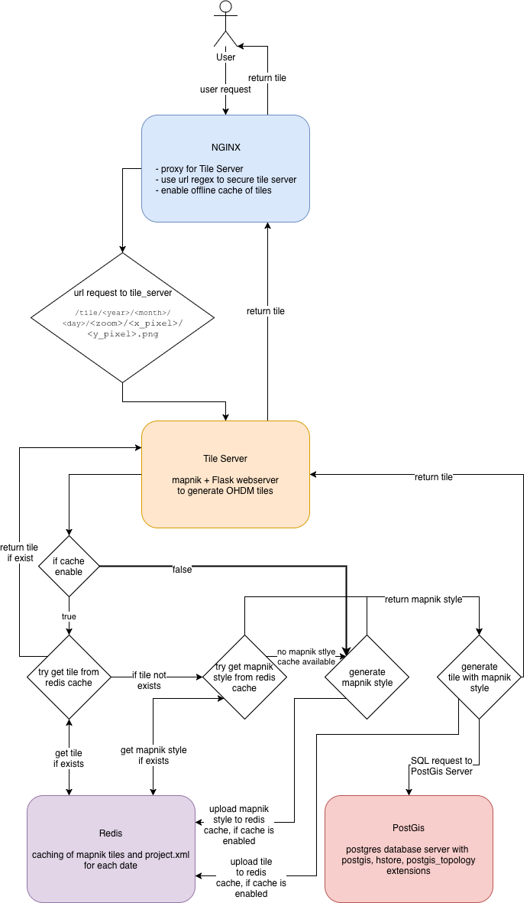

Tile Server
===========

The Tile Server is based on:

+------------------------------------------------------------------------------+--------------------------------------+
| Software / Framework                                                         | Function                             |
+------------------------------------------------------------------------------+--------------------------------------+
| `Mapnik <https://mapnik.org/>`_                                              | tile gernator                        |
+------------------------------------------------------------------------------+--------------------------------------+
| `Python bindings for Mapnik <https://github.com/mapnik/python-mapnik>`_      | Python bindings for Mapnik           |
+------------------------------------------------------------------------------+--------------------------------------+
| `Redis <https://redis.io/>`_                                                 | cache for tiles & Mapnik styles      |
+------------------------------------------------------------------------------+--------------------------------------+
| `PostGis <https://postgis.net/>`_                                            | OHDM Database                        |
+------------------------------------------------------------------------------+--------------------------------------+
| `Flask <http://flask.pocoo.org/>`_                                           | Python microservice webserver        |
+------------------------------------------------------------------------------+--------------------------------------+
| `openstreetmap-carto <https://github.com/gravitystorm/openstreetmap-carto>`_ | OSM styles for Mapnik                |
+------------------------------------------------------------------------------+--------------------------------------+
| `NGINX <https://nginx.org/>`_                                                | Webserver to use flask in production |
+------------------------------------------------------------------------------+--------------------------------------+

    Tile Server overview

URL Mapping
-----------

The Tile Server listen on ``https://<hostname>/tile/<year>/<month>/<day>/<zoom>/<x_pixel>/<y_pixel>.png``

Example for display the World on the ``01.01.2019`` on the host ``example.com`` is
``https://example.com/tile/2019/01/01/0/0/0.png``

Source Code
-----------

The source code of the Flask microservice is on ``tile_server/code/app.py``
